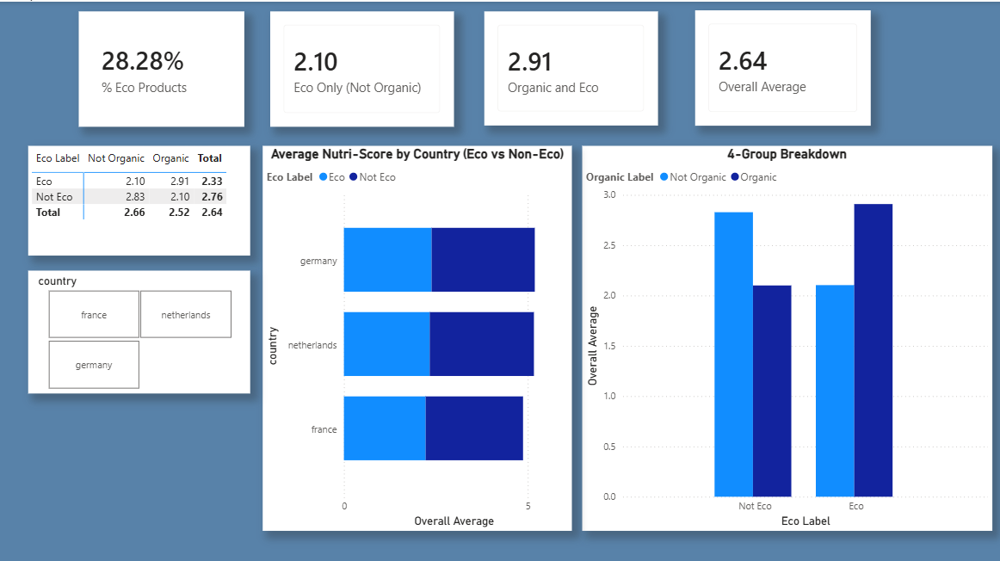

**Is Eco Always Healthy?**

# Project Overview

          This project explores whether eco friendly packaging is actually linked to healthier food products in Germany, France, and the Netherlands, or if it is mainly used as a marketing strategy.

I analyzed *145 food products* from *Germany, France, and the Netherlands* using data from the *Open Food Facts API*.

#

I collected product data using Python and grouped the products based on:

 **Eco-friendly packaging** (glass, paper, cardboard, or recyclable metal)
 
 **Organic label**

For this project, I considered packaging to be eco-friendly if it included glass, paper, cardboard, or recyclable metal and products that also contained some plastic were still included if they showed a clear effort to use more sustainable materials.

Then I compared the average Nutri-Score of each group. (Nutri-Score A = 5 and E = 1.)

## Results

Not Eco + Not Organic: Average Nutri-Score 2.83

Not Eco + Organic: Average Nutri-Score 2.10

Eco + Not Organic: Average Nutri-Score 2.10

Eco + Organic: Average Nutri-Score 2.91

### Findings

* Products with only **eco-friendly** packaging had the lowest average score (2.10).
* Products with only an **organic label** also had a score of 2.10.
* Products that were both **organic** and **eco-friendly** had the highest average score (2.91).

## Conclusion

The results suggest that eco-friendly packaging alone **does not** always mean a product is healthier. However, products that are both organic and use eco-friendly packaging had the **best** nutritional scores in this dataset.

## Tools Used

* Python (requests, pandas, json)
* Power BI
* DAX
* Open Food Facts API

## 📷 Dashboard

# Limitations

This project only looks at the nutritional quality of products. It does not include sales or customer purchasing data, so it cannot explain why customers choose eco-friendly products.
